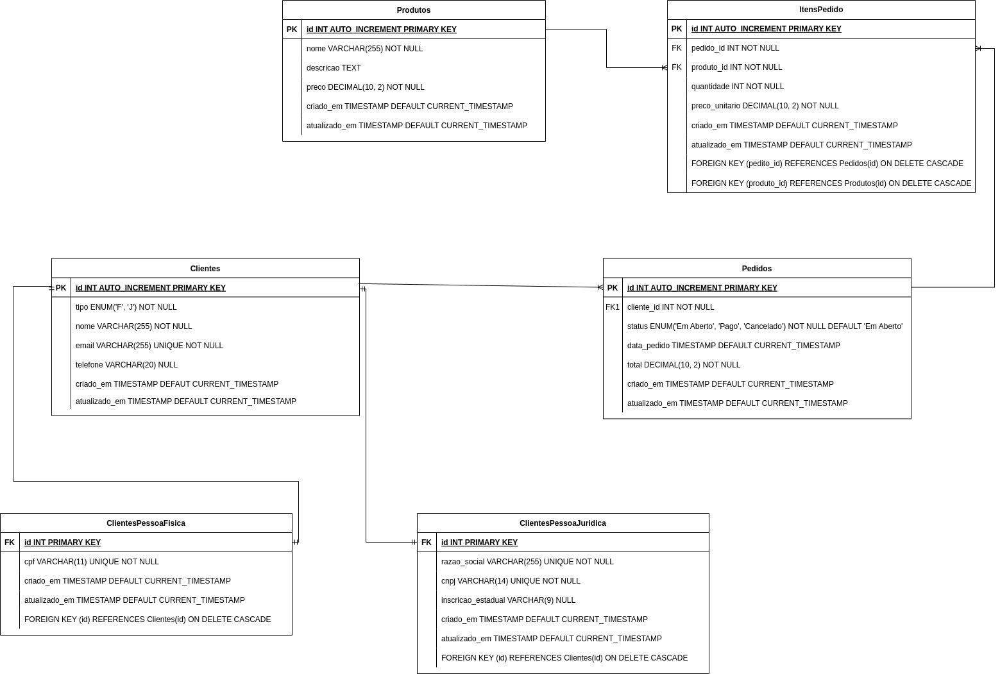

# CodeIgniter 4 Application Starter

## Dependências

- MySQL
- PHP 8.3

## Documentação da API

A API está descrita no arquivo `CodeIgniter-4-Purchase-API.postman_collection.json` bastando abri-lo no Postman.

## Modelagem dos Dados

